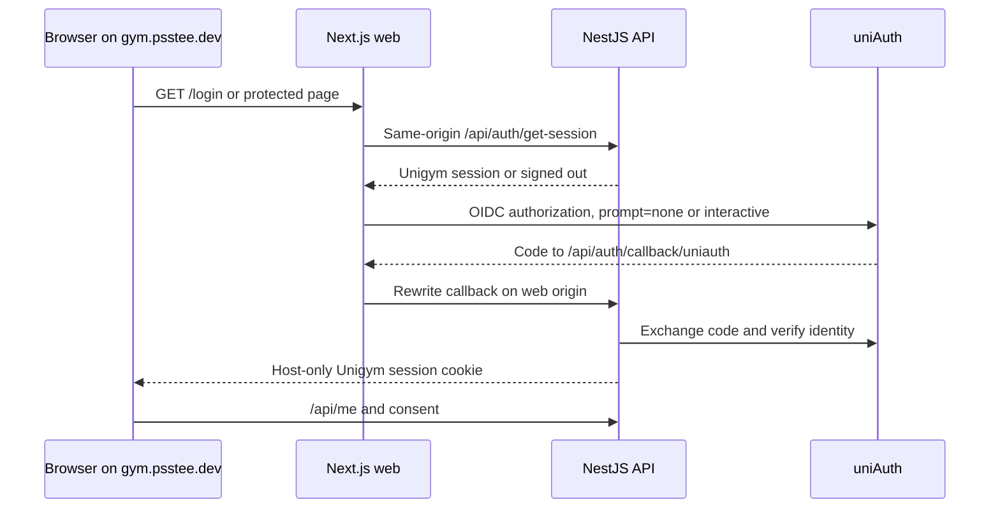
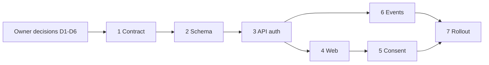

# Unigym × uniAuth integration plan

Status: **Implemented in the app checkout; production rollout is pending image publication, sealed runtime and backup secrets, and cluster verification.** D1–D6 were chosen by the owner. The owner also approved the drafted Unigym Terms and Privacy text for production on 29 September 2026.

## Goal and contract

Use uniAuth as Unigym's only identity provider. Unigym owns its session, future gym data and authorization, and consent. There is no Member system to implement now. A signed-out visitor may check uniAuth once silently; a signed-in visitor can then enter Unigym without another login page. Identify a person by the OIDC `sub`, never by email.

This plan applies the [current uniAuth integration guide](https://github.com/unishare-oss/uniAuth/blob/main/docs/integrating-an-app.md) (GitHub `main` file SHA `72a25c40d903d2699ae1e7fca047fc367af86967`, checked 2026-09-29) to this checkout. The guide says the production client, sealed secret, registry entry, DNS, and tunnel routing already exist, and that Unigym has no deployed dev environment. Verify those claims during deployment because k8s-practice and uniAuth are separate repositories.

## Starting checkout (before implementation)

- `apps/api` is NestJS 12 on Bun, Prisma 7 and PostgreSQL. It exposes `/health` and has no auth or user routes.
- `apps/api/prisma/schema.prisma` has only `Member(id, externalSubject, createdAt, updatedAt)`. Earlier migrations created and then removed auth tables; review migration history before regenerating them.
- `apps/web` is Next.js 16. Its only rewrite maps `/api/health` to API `/health`; there is no auth UI, proxy, or consent page.
- The API defaults to port 3001. No Better Auth package or uniAuth integration is installed.

## Decisions for the owner

Record each choice before the dependent step. Recommendations are proposals, not defaults to execute silently.

| ID          | Choice                    | Recommended option and reason                                                                                                                                        | Alternative and cost                                                                                                                                                                                        | Needed before |
| ----------- | ------------------------- | -------------------------------------------------------------------------------------------------------------------------------------------------------------------- | ----------------------------------------------------------------------------------------------------------------------------------------------------------------------------------------------------------- | ------------- |
| D1 — chosen | Local auth/session engine | **Better Auth 1.7+ in NestJS**, generic OAuth and Prisma adapter. Matches the guide's callback, cookie, and account mapping.                                         | Direct NestJS OIDC plus custom sessions gives more control and fewer auth framework abstractions, but requires implementing code exchange, token validation, session rotation, logout, and account linking. | Step 1        |
| D2 — chosen | Unused Member table       | **Use only Better Auth's local `User`/`Account`/`Session` records for now. Remove the placeholder `Member` model/table if empty, after checking the real database.** | If it contains rows, preserve them and bring the finding back for a separate migration decision.                                                                                                            | Step 2        |
| D3 — chosen | Visitor behavior          | **Silent check on public entry points and before protected content**, with a 10-minute throttle and bot bypass.                                                      | Protected pages only avoids redirects for anonymous home visitors, but a public visitor will not acquire a local session until entering a protected flow.                                                   | Step 4        |
| D4 — chosen | Terms gate                | **Required before protected gym use**, with timestamp stored on local auth user; terms and privacy remain public.                                                    | Gate only certain actions permits read access without consent; define exactly which actions if chosen.                                                                                                      | Step 5        |
| D5 — chosen | Deletion policy           | **Delete local user, accounts, and sessions on verified uniAuth account deletion.** Future gym data must declare cascade or explicit cleanup.                        | Retain an anonymized record only with a defined retention reason and fields.                                                                                                                                | Step 6        |
| D6 — chosen | Rollout scope             | **App integration plus k8s-practice review/deploy plan**, with production smoke test after client secret is available.                                               | Stop at app code/local validation; production behavior remains unverified.                                                                                                                                  | Step 7        |

Additional choices at implementation time: consent text and terms/privacy URLs, whether profile fields are read only links to uniAuth, and exact retention obligations for future gym data. Do not invent these in UI copy.

## Architecture

The web host proxies `/api/:path*` to the API. The API's Better Auth `baseURL` is the **web** origin. The cookie is host-only with `unigym` prefix. The API host remains available for server-to-server event receivers but is not used for browser sessions. Set the API's route prefix deliberately so `/api/auth/*`, `/api/me`, `/api/uniauth/*`, and `/api/health` resolve consistently.

## Step 1 — Validate the integration contract

**Context:** The current uniAuth guide is the contract; this app differs from its Hono example. Pin compatible Better Auth 1.7+ and `@better-auth/*` versions together. Check the installed package APIs and NestJS mounting behavior before writing routes. Better Auth's official NestJS guide offers a community maintained integration that changes body parser and global guard behavior; decide whether to use that package or mount the handler directly through NestJS/Express. This is an implementation choice within D1, with direct mounting preferred if the integration's global guard affects unrelated routes.

**Work:** Verify the existing Unigym entry in uniAuth `apps/server/src/apps/registry.ts`, its `UNIGYM_ORIGIN` mapping in `apps/server/src/config/env.ts`, and `apps.unigymOrigin` in k8s-practice `uniauth-chart/values.yaml`. The guide says these already exist; do not add a duplicate registry entry or create another production OAuth client. Confirm the production client ID `JEYwnWJjIVmRqIbpAauDsnKkUKMkLnnJ`, web origin `https://gym.psstee.dev`, API origin `https://gym-api.psstee.dev`, discovery, JWKS, Better Auth 1.7 callback, post-logout redirect, and all three event receiver URLs. Record env names without secrets. Document local callback URL using `127.0.0.1` and existing API port 3001 unless ports are deliberately changed. Treat the guide's `uniauth-values-dev.yaml` example as a chart value only; it does not mean a Unigym dev deployment or client exists.

**Exit:** An explicit config matrix for local and prod; the already registered Unigym entry and chart values are checked; callback and event paths match the registered client; no secret committed.

## Step 2 — Add local auth schema and identity mapping

**Depends on:** D1, D2, Step 1.

**Work:** Add Better Auth's Prisma models using its schema generator as a starting point, review the migration, and add `consentGivenAt` on the local auth user. Do not create a gym Member relation. Inspect the existing `Member` row count before deciding whether to drop its placeholder table; never discard rows or reassign identity by email. Reuse `PrismaService`'s Prisma client and PostgreSQL adapter rather than creating another connection pool.

**Exit:** Migration runs and rolls forward on a fresh database; sign-in creates one `Account(providerId=uniauth, accountId=sub)` and one local user; repeated sign-in does not duplicate the auth user. Existing Member rows are accounted for before any table removal.

## Step 3 — Implement API auth and sessions

**Depends on:** Step 2.

**Work:** Configure generic OAuth with discovery, PKCE, scopes, confidential client credentials, userinfo refresh, `unigym` cookie prefix, host-only cookie, trusted web origin, and web origin `baseURL`. Mount `/api/auth/*` in NestJS with the required raw request semantics. Add `/api/me`, an authentication guard for future gym routes, and a single `resolveLocalUserId(sub)` helper that looks up the uniAuth Account row. Keep passwords, social provider login, roles, bans, and gym authorization out of uniAuth integration.

**Exit:** Browser receives a Unigym cookie on the web host; authenticated `/api/me` works; unauthenticated call returns 401; duplicate or spoofed email never merges two different `sub` values.

## Step 4 — Implement web sign-in and session handling

**Depends on:** Step 3 and D3.

**Work:** Replace the health-only rewrite with a deliberate `/api/:path*` rewrite. Add Better Auth client, login route, return route, silent check, short-lived throttle cookie, and same-origin return URL validation. Add Next.js `proxy.ts` for protected routes as a navigation convenience; API guards remain authoritative. Add sign-out through uniAuth's `/logout`, settings links to uniAuth account page, and error states. Do not trigger a second navigation after `signIn.social` starts. Ensure `prompt=none` failure with `login_required` returns to the page without a redirect loop.

**Exit:** Signed-out visitor sees login only after a failed silent check; existing uniAuth session signs in without a visible login page; errors return to a usable page; logout ends the local session and returns from uniAuth; open redirects are rejected.

## Step 5 — Add Unigym consent

**Depends on:** D4 and Steps 3–4.

**Work:** Obtain owner-approved terms and privacy text/URLs before publishing the screens. Add a one-time consent screen after first OIDC login, a session-protected `POST /api/users/me/consent`, and a server-side gate on protected gym endpoints. Record `consentGivenAt` only after an explicit action. Provide sign-out from the gate.

**Exit:** First-time user cannot use protected gym routes until consenting; returning user is not prompted again; terms/privacy and sign-out remain accessible.

## Step 6 — Add verified uniAuth event receivers

**Depends on:** D5 and Step 3.

**Work:** Implement form POST receivers for back-channel logout, user deletion, and profile updates. Verify JWT signature against issuer JWKS, issuer, audience, expected single event, absence of nonce, and valid subject. Map `sub` via Account, never email. Delete sessions on logout. For deletion, remove the local auth user and related rows in safe order; add explicit cleanup when gym data exists. For updates, refresh name, email, verification state, and avatar, including `picture: null` clearing. Handle a changed email that conflicts with another local user without remapping identities. Make repeated notices idempotent: unknown subject returns 200, invalid token returns 400. Log processing failures without logging tokens.

**Exit:** Tests cover valid, wrong audience/issuer/event, mixed events, nonce, unknown subject, repeated delivery, removed avatar, email conflict, and deletion cleanup. A signed-out session no longer authorizes API calls.

## Step 7 — Local end-to-end and rollout

**Depends on:** D6 and Steps 1–6.

**Work:** Run local uniAuth and a local OAuth client following the guide, using `127.0.0.1` for the web callback and this app's actual ports. Use the existing Unigym DB workflow or an isolated test DB; avoid clashing with uniAuth's sample port 5433. Exercise signed-out/signed-in silent checks, sign-in, session, consent, logout, and return URLs. Local clients do not receive HTTPS-only server events, so test receivers using locally signed fixtures and then smoke test real delivery in production. Review k8s-practice chart values, ingress routing, secret key names, `UNIAUTH_ISSUER`, `UNIAUTH_CLIENT_ID`, `BETTER_AUTH_URL`, `BETTER_AUTH_SECRET`, `NEXT_PUBLIC_UNIAUTH_URL`, and API-to-web rewrite URL. Verify the already claimed DNS/tunnel/client configuration before deployment.

**Exit:** Lint, typecheck, API tests, web build, migration check, and browser flow pass. Production smoke test confirms callback, host-only cookie, `/api/me`, consent, logout, and real event delivery. Record any event delivery that cannot be tested because maintainer access is required.

## Sequence and checkpoints

Review the contract and schema migration before application code; review session and redirect behavior before deploying; review deletion policy before enabling the deletion receiver. Keep each step independently reviewable. Deployment is included by the owner's D6 choice, with a separate review of production values before release.

## Risks to resolve early

- **NestJS mounting:** Better Auth's Fetch handler and NestJS/Express body parsing may conflict. Prove a callback and session request before building the rest of the UI.
- **Dormant table:** `Member.externalSubject` exists from the scaffold. Inspect data before any removal; never infer identity from email.
- **Cookie and proxy:** A callback on the API host or a parent-domain cookie breaks the intended per-app session boundary. Assert the browser cookie domain and callback host in end-to-end verification.
- **Secret and environment drift:** The guide's production client is external to this repo. Compare deployed values against the registered client before release.
- **Best-effort events:** uniAuth retries are not guaranteed for deletion/update notices. Keep receiver operations idempotent and establish a manual replay procedure with the maintainer.

## References checked

- [Current uniAuth integration guide](https://github.com/unishare-oss/uniAuth/blob/main/docs/integrating-an-app.md), especially §1 on the existing Unigym registry entry, plus the copy supplied by the owner in this conversation.
- [Better Auth NestJS integration](https://better-auth.com/docs/integrations/nestjs): documents the community maintained module, body parser setting, and global guard behavior.
- [Better Auth Prisma adapter](https://better-auth.com/docs/adapters/prisma) and [schema CLI](https://better-auth.com/docs/concepts/cli): document Prisma 7 setup and schema generation.
- [Better Auth 1.7 upgrade guide](https://better-auth.com/docs/guides/1-7-upgrade-guide): documents the generic OAuth sign-in API change.
